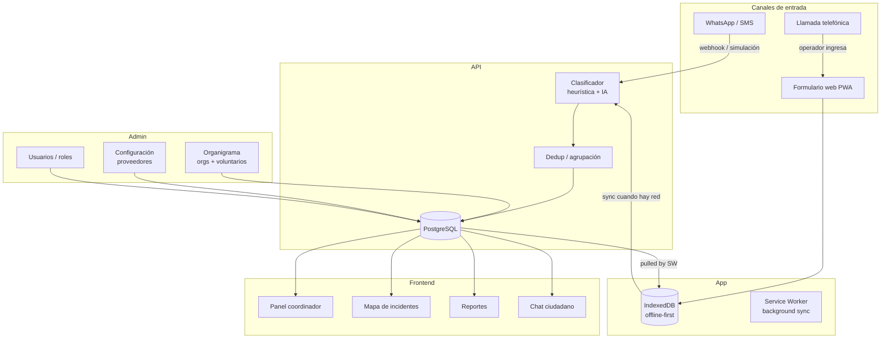

# Puente de Vida — Coordinación de Emergencias

**Puente de Vida** es una plataforma de coordinación de emergencias **offline-first** diseñada para que la información crítica de rescate y ayuda humanitaria continúe fluyendo incluso sin conexión a Internet.

> **Ningún reporte debería perderse porque se cayó Internet.**

---

## Diagrama de flujo



---

📘 [**Documentación técnica**](docs/TECNICO.md) — arquitectura, clasificación offline, proveedores, API
🧭 [**Roadmap**](docs/ROADMAP.md) — mejoras planificadas y cómo aportar

---

## 🚀 Características

- **Offline-first:** IndexedDB local + Service Worker con background sync. Opera sin conexión y sincroniza al recuperar red.
- **Clasificación híbrida:** Heurística local (baseline, sin costo) + proveedor de IA configurable (OpenAI-compatible).
- **PWA liviana:** Vite + React + TanStack Router. Build estático, sin SSR, bundle mínimo.
- **Panel de coordinación:** Reportes priorizados, filtros por tipo/urgencia/completitud, métricas en vivo.
- **Mapa de incidentes:** Leaflet + OpenStreetMap con puntos coloreados por prioridad.
- **Chat ciudadano:** Visualización pasiva de mensajes entrantes con respuestas automáticas del bot.
- **Admin completo:** Login con roles (viewer / operator / admin), estadísticas, export CSV/JSON, gestión de usuarios, configuración de proveedores, organigrama de organizaciones y voluntarios con mapa.
- **WhatsApp conmutable:** Simulador emulado gratis por defecto. Conectar Meta/Kapso/360dialog solo requiere variables de entorno.

---

## 🛠️ Stack

| Capa     | Tecnología                                        |
| -------- | ------------------------------------------------- |
| Frontend | Vite + React 19 + TanStack Router + Tailwind      |
| Backend  | Node.js + Fastify + TypeScript                    |
| DB       | PostgreSQL + Dexie.js (IndexedDB local)           |
| Mapas    | Leaflet + OpenStreetMap                           |
| PWA      | vite-plugin-pwa + Service Worker custom           |
| IA       | Heurística local / OpenAI-compatible (conmutable) |
| WhatsApp | Simulador mock / proveedor genérico vía API       |

---

## 📁 Estructura

```
├── apps/
│   ├── api/          # Fastify + PostgreSQL
│   └── web/          # Vite + React PWA
├── material-visual/  # Brand assets (logos, tipografía)
├── docker-compose.yml
└── package.json      # Monorepo npm workspaces
```

---

## 💻 Inicio rápido

### Docker (recomendado)

```bash
npm run up
# Web: http://localhost:3000
# API: http://localhost:4000

npm run down  # detener
```

### Desarrollo local

```bash
npm run db:up        # PostgreSQL en Docker
npm run dev          # API + Web con hot reload
```

---

## 📋 Comandos útiles

```bash
npm run typecheck    # TypeScript check
npm run lint         # ESLint
npm run build        # Build producción
```

### Seed de datos

```bash
# Reportes demo con tráfico variable realista
npm run seed:demo -w @pdv/api -- 1500

# Organizaciones, voluntarios y usuarios de prueba
npm run seed:orgs -w @pdv/api

# Simulador con rate control
npm run sim -w @pdv/api -- --rate 20 --total 300
```

Usuarios de prueba (crear con `seed:orgs`):

| Usuario    | Contraseña     | Rol      |
| ---------- | -------------- | -------- |
| `lector`   | `lector2026`   | viewer   |
| `operador` | `operador2026` | operator |
| `admin`    | `PdV2026!`     | admin    |

---

## 💬 WhatsApp

Por defecto corre en **modo simulado** (sin costo). Los mensajes se ven en la sección Ciudadanos y se clasifican automáticamente.

Para activar un proveedor real, configurar en el panel Admin → Configuración o en `.env`:

```env
WHATSAPP_MODE=generic
WHATSAPP_API_URL=https://tu-proveedor/api
WHATSAPP_API_KEY=tu-api-key
```

## 📄 Licencia

MIT
